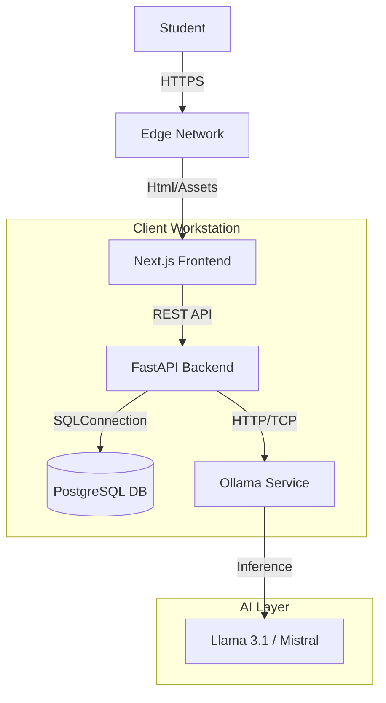
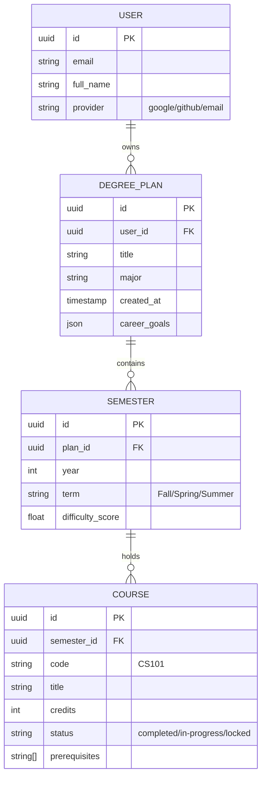

# DegreePlanner Agent - System Design Document

## 1. System Overview
**DegreePlanner Agent** is an intelligent, privacy-first academic planning platform designed to help students map out their university degree. It combines deterministic algorithms (for prerequisite validation) with generative AI (for qualitative advice, career alignment, and burnout analysis).

**Core Philosophy:**
- **Privacy First:** All AI processing happens locally via Ollama. No student data leaves the machine.
- **Deterministic Validity:** We don't guess if a schedule is valid; we prove it mathematically using graph theory.
- **Holistic Planning:** We optimize not just for graduation speed, but for mental health (burnout risk) and career ROI.

---

## 2. High-Level Design (HLD)

### 2.1 Architecture Diagram
The system follows a modern **Client-Server Architecture** with a dedicated AI Inference layer.

### 2.2 Core Modules

#### A. Frontend (Presentation Layer)
- **Framework:** Next.js 16 (React 19)
- **Responsibility:**
  - **State Management:** Uses `Zustand` to manage the complex graph state of the degree plan.
  - **Visualization:** `ReactFlow` for the interactive node-based prerequisite graph.
  - **UI/UX:** Premium "Glassmorphism" aesthetic using `Tailwind CSS 4` and `Framer Motion`.
  - **Auth:** Context-based authentication handling Firebase tokens.

#### B. Backend (Logic Layer)
- **Framework:** FastAPI (Python 3.11)
- **Responsibility:**
  - **API Gateway:** Routes requests for plans, auth, and analysis.
  - **Validation Engine:** `Pydantic` models ensure data integrity before persistence.
  - **Orchestrator:** Manages the flow between the Database and the AI Service.

#### C. Database (Persistence Layer)
- **Technology:** PostgreSQL 16
- **Responsibility:** Relational storage of Users, Plans, Semesters, and Courses with strict foreign key constraints.

#### D. Intelligence Engine (AI Layer)
- **Technology:** Ollama (Local Interface)
- **Responsibility:**
  - Running quantized LLMs locally (e.g., `llama3.1:8b`).
  - **Prompt Engineering:** specialized prompts for "Burnout Calculation", "Career Advice", and "Syllabus Analysis".

---

## 3. Low-Level Design (LLD)

### 3.1 Database Schema (ERD)

### 3.2 Key Algorithms

#### A. Prerequisite Validation (Topological Sort)
To ensure a valid graduation path, we model the degree as a **Directed Acyclic Graph (DAG)**.
- **Nodes:** Courses
- **Edges:** Prerequisite relationships
- **Algorithm:** Kahn's Algorithm
  1. Calculate *indegree* (number of unmet prerequisites) for all courses.
  2. Courses with `indegree == 0` are available to take.
  3. When a course is scheduled, decrement indegree of its neighbors.
  4. If a cycle is detected (Course A requires B, B requires A), flag as "Circular Dependency Error".

#### B. Burnout Risk Calculation
A heuristic formula to estimate semester difficulty:
$$ \text{Difficulty} = \sum (\text{Course Credit} \times \text{AI Complexity Weight}) + \text{Context Penalty} $$
- **AI Complexity Weight:** 1.0 (Intro) to 2.5 (Capstone/Thesis).
- **Context Penalty:** Added if >2 "Hard" courses (e.g., Systems Programming + Algorithms) are in the same term.

### 3.3 API Design (REST)

| Method | Endpoint | Description |
| :--- | :--- | :--- |
| **POST** | `/api/auth/login` | Authenticate user & return JWT |
| **GET** | `/api/plans` | List all degree plans for user |
| **POST** | `/api/plans` | Create a new degree plan |
| **POST** | `/api/ai/analyze` | Send full plan JSON -> Get detailed AI insights |
| **POST** | `/api/ai/advisor` | Chat with Career Advisor (Context-aware) |
| **POST** | `/api/manual-entry` | Parse raw text input into structured Course objects |

---

## 4. Technology Stack & Decisions

| Component | Technology | Rationale |
| :--- | :--- | :--- |
| **Frontend** | Next.js 16 | Server Components for speed, Client Components for interactivity. |
| **Styling** | Tailwind CSS 4 | Utility-first, zero-runtime overhead, rapid UI development. |
| **Animations** | Framer Motion | Physics-based animations for the "Premium" feel. |
| **Backend** | FastAPI | High performance (async/await), auto-swagger docs, Pydantic integration. |
| **ORM** | SQLAlchemy (Async) | Robust SQL abstraction, migration support (Alembic). |
| **Database** | PostgreSQL | Reliability, complex relational queries, JSONB support for flexible metadata. |
| **AI Runtime** | Ollama | Easy local deployment, supports GGUF models, privacy compliant. |

---

## 5. Security & Privacy

### 5.1 Authentication Guard
- **Firebase Auth** handles the identity provision (Google/GitHub sign-in).
- **Verify Token:** The backend validates the Firebase JWT on every protected route using `HTTPBearer`.
- **Row Level Security (Logic):** API endpoints strictly enforce `user_id` checks. User A cannot read User B's plans.

### 5.2 Local Data Privacy
- **No Cloud Uploads:** Transcript data is strictly processed in memory.
- **Ephemeral AI Context:** The context sent to Ollama is constructed at request time and discarded after the response. No training on user data occurs.

---

## 6. Scalability & Performance

- **Async I/O:** FastAPI running on `uvicorn` handles thousands of concurrent connections using Python's `asyncio`.
- **Optimistic UI:** The Frontend updates the graph immediately (drag & drop) while syncing with the DB in the background.
- **Caching:** AI results (which are expensive) can be cached in the future using Redis, keyed by a hash of the plan configuration.

---

## 7. Future Roadmap
- **Collaboration Mode:** Real-time multiplayer planning (WebSockets).
- **University Integrations:** Direct SIS (Student Information System) sync via API.
- **Mobile App:** React Native port using the same shared logic.
